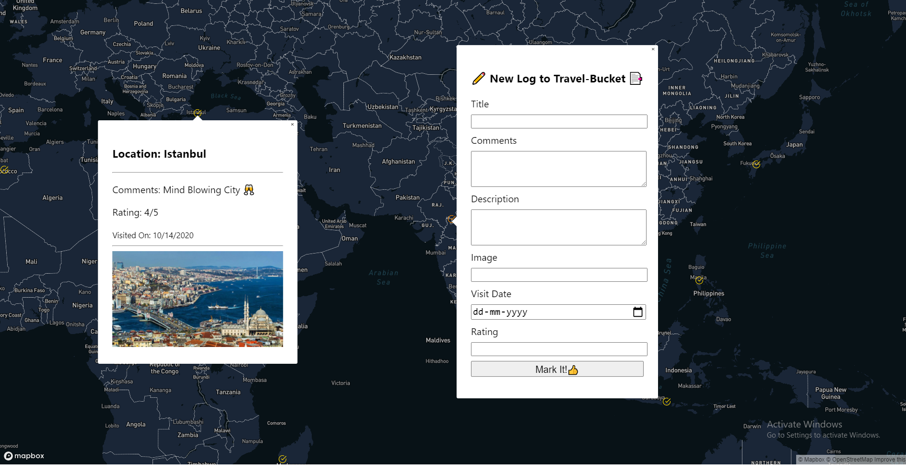
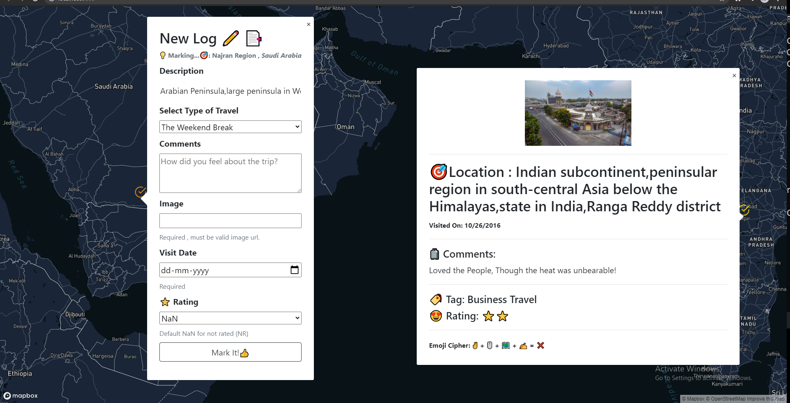
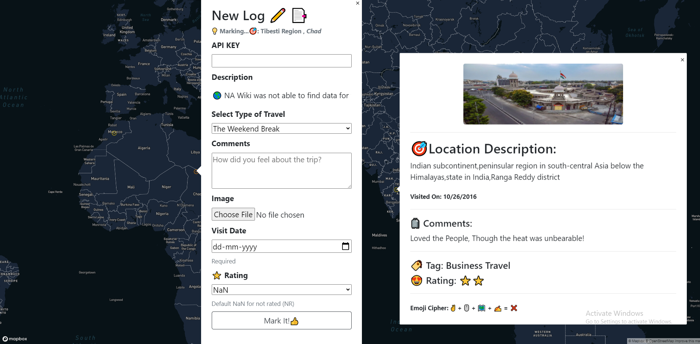
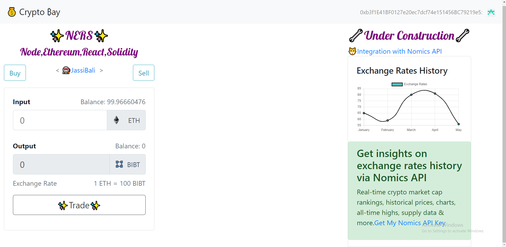
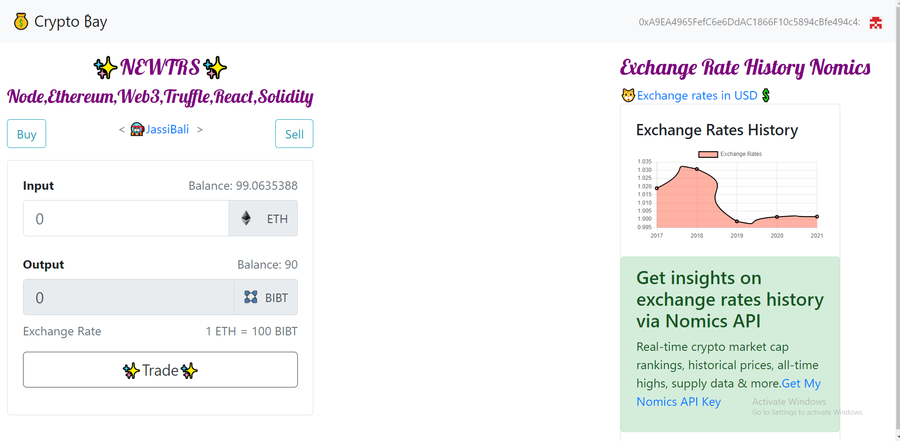

# Full Stack Projects Collection

****Ticket 21,17 - Need to implement breakpoints   media queries for mobile display problems in material ui, need to learn first how to do them aghhhhh!!!🐱‍👤****

> ### Status:
****Working on Project 1 Version 1.3.0 & to test & deploy Project 2 version 1.0.0 Completed to test it on a test network like tron ,Initiated Project 3 🛸****

> ### TO DO
- [x] ****Project-1 Travel Bucket List ---****
   - [x] ****Completed --> deployed at https://travel-bucket-jassi.vercel.app****
   - [ ] ****Version 1.3 Update,Delete and Like functionality with Full Auth****
- [ ] ****Project-2 Blockchain Currency Exchange App****
    - [x] ****To first Understand how to make your own cryptocurrency via ERC-20 token standards.****
    - [x] ****Work on Smart Contracts ethSwap and bibaToken.****
    - [x] ****Build User Interface for Buy & Sell Token****
    - [x] Integrate nomics
    - [ ] deploy V1.0.0
- [ ] ****Research on Project 3 related to Web dev + ML/AI + DV****
  - [ ] V1.0.0
    - [ ] backend
    - [ ] frontend

***

> ### Project-1 : Travel Bucket-list App ‍🧳 ✈️ 🪂 🧗‍♀️ 🎎 🥂

> #### Version-1 First Look (Development localhost)
‍💜🚀------‍💜‍----->🚀

> #### Features
- GET,POST Entries in the travel bucket list via backend(api).
- Create New Travel Entry via double click on map via Front-end UI Form on the custom map from mapbox.

***
> #### Updates 1.1 (undeployed)
- [x] dropdown with stars for rating.
- [x] red alert div message set up if error occurs while new log entry in the DB.
- [x] automatic description fill(make it readonly prop) with location corresponding to latitude and longitude Coordinates.https://www.bigdatacloud.com/geocoding-apis/free-reverse-geocode-to-city-ap
***

> #### Updates 1.2 (deployed)
- [x] Added Image upload, progress Bar, Image preview client side image upload success and image url grabbed and stored in DB :)
- [x] thumbnail(rounded) modified for pop ups travel log on map
- [x] added image moderation for offensive/nude/weapon/drugs or other unacceptable content detected client side
- [x] wrong filetype,size image upload check client side validation added.
- [x] App icon updated
- [x] Basic Universal API key for making new travel entries backend verification added
- [x] refactored css media queries a bit to make the pop ups responsive in mobile view & Desktop
- [x] Added mark my location on map feature with toggle via mapbox api component GeolocateControl
- [x] Added IP tracking for flagged users via https://www.bigdatacloud.com/ip-geolocation-apis
- [x] Added Draggable Marker
- [x] now duplicated type of travel allowed removed restrictions on title/type of travel at backend.
- [x] Deployed backend & frontend at vercel/now.sh with mongoDB

***

==============================================================================

> ##                    DEVELOPER SECTION

===============================================================================

> #### Tech Stack

- [x] Node.js
- [x] Express
- [x] MongoDB
- [x] React & React Hooks
- [x] Mapbox
- [x] Cloudinary
- [x] sightengine

> #### Core dependancies

- [x] express
- [x] cors( Integrate frontend-backend)
- [x] morgan( logger that logs all the incoming requests Debugging purposes)
- [x] helmet (to configure what headers will be sent back as response by our server Security purposes)
- [x] mongoose( object modelling tool for MongoDB)
- [x] body-parser (middleware to parse the request body)
- [x] react-map-gl (to use mapbox maps via accesstoken in react)
- [x] react-hook-form https://react-hook-form.com/
- [x] bigdatacloud API https://www.bigdatacloud.com/
- [x] express-rate-limiter , rate-limit-mongo (API rate limiters)
- [ ] multer & multer storage cloudinary to handle multipart/form-data and upload images to cloudinary (backend).

> #### Dev dependancies

- [x] eslint ( identifying and reporting on patterns found in ECMAScript/JavaScript code.) https://www.npmjs.com/package/eslint
- [x] nodemon (restart the server after we make changes)

> #### Blueprint

- [x] Setup server
  -  install dependancies
  -  install /setup linter
  -  setup Express App
  -  setup not found and error middlewares
- [x] model DB
  - what data to store
- [x] setup mongoose
- [x] POST /journey/logs
  -  create a new log entry
- [x] GET /journey/logs
  -  list all log entry
- [x] Setup client
- [x] list all log entries on map
- [x] Setup Double click on any location on map to pop up marker with different color(so that when we actually submit that form that marker changes to normal color) and a form with it in UI for User to just add that log entry instead of specifying latitude & longitude manually via API.
- [x] create form to add a new entry
- [x] setup map sdk
- [x] global API access key to make new travel entry established at backend.
- [x] Deploy backend (https://vercel.com/cli)now.sh(backend) & MongoDB(database)
- [x] Deploy frontend React to vercel and set up cors origin and access so that backend and frontend part deployed can interact.

- [ ] Version 1.3
  - [ ] Edit Travel entry
    - [ ] render seperate component as edit form with already filled values using useEffect as it triggers every time render takes place.
    - [ ] make sure to make the updateprocess state variable false to render the map component once update process is complete.
  - [ ] Auth setup full.
  - [ ] Make the landing page
  - [ ] Map page auth protected.
  - [ ] Register,login JWT & google sign in

> ### For Future Versions
> #### Not Implemented Yet , For Version 2 & Extra's that can be added
refer-https://react-hook-form.com/

- [ ] UI Improvements

    - [ ] Create & style a nav bar uptop like the firetracker api for starters. https://codepen.io/katydecorah/pen/HEgwl
    - [ ] Work on style and colors for popup and entry form heading and params.
    - [ ] Text moderation and Limit comments character limit, first convert to english then moderate for comments section.
    - [ ] upon moderation fail case of image or text redirect the user to a image offensive page message and block the IP OF the user to restrict accessing the site.
    - [ ] Tag and additional cloudinary functionalities image recoginition https://cloudinary.com/documentation/additional_upload_api_options
    - [ ] Need to reconfigure the upload image routes to cloudinary at backend, currently the upload images via upload preset is successfull on client side.
    - [ ] Starability rating dynamic star selection rather than select.
    - [ ] Make the form responsive for mobile view
    - [ ] flash messages for the UI/UX Logging in ,Signing Up,Log entry created success or error occured. refer books api
    - [ ] set up proper validation with JOI for inputs and all routes edit,delete,signup,login to avoid dummy data,foul language data.
    - [x] Added Draggable marker.
    - [x] image moderation for no nude/voilence/disturbing/raw content.
    https://dashboard.sightengine.com/getstarted
    - [x] added danger message when image is flagged and automatic removal of submit button.
    - [x] wrong filetype/size restrictions client side check done etc.
    - [x] thumbnail via react-bootstrap images rounded.
    - [x] update the favicon icon use a custom or your own icon for page rather than default react app
    - [x] Upload Image via client side DONE with progress bar and url from cloudinary stored in MongoDB.
    - [x] set dropdown with stars for rating refer react-hook-form docs.
    - [x] red alert div message set up if error occurs while new log entry in the DB.
    - [x] automatic title fill(make it readonly prop) with location corresponding to latitude and longitude Coordinates.https://www.bigdatacloud.com/geocoding-apis/free-reverse-geocode-to-city-api

***
- [ ] Backend Improvements
   - [ ] Can make use of crypto npm to generate random API keys.
   - [ ] Set up Edit route
      - [ ] Backend only
      - [ ] Integrate with frontend
   - [ ] Set up Delete route
      - [ ] Backend only
      - [ ] Integrate with frontend
   - [ ] Add New User Signup/Login and Email verification.(via backend)
      - [ ] User Profile /pic upload https://stackabuse.com/handling-file-uploads-in-node-js-with-expres-and-multer/
   - [ ] Protect the map displaying routes only show it to the logged in user and only allow the user to make a marker if he/she verifies email.
   - [ ] save the morgan generated logs in database or local storage to know who visited kinda security/debugging.
 refer https://www.npmjs.com/package/morgan dual logging in apache format and uuid to each request section.
   - [x] Added Rate Limiters for Mongo and Post new travel entry.
   - [x] capture IP's of the flagged user and store in DB. via bigdata cloud Ip geolocation API.
***

> #### Refactoring  Options

- [ ] mongoose geojson https://mongoosejs.com/docs/geojson.html
& can also refer timestamp 121 geomaps area.

> #### Issues !!
- [ ] image upload via backend not completed yet , the object imagesStringArray gets destroyed when it reaches backend.
- [ ] when user types long string without spaces in textbox the textbox overflows when we view it in pop up.
https://stackoverflow.com/questions/1731190/check-if-a-string-has-white-space
- [ ] Need to address the situation where user type space, tabs etc in the textbox https://stackoverflow.com/questions/1172206/how-to-check-if-a-text-is-all-white-space-characters-in-client-side/1173854
- [x] logentries.map, Operation `logsentries.find()` buffering timed out after 10000ms is not a function sometimes Mongoose throws error buffering timed out need to handle the error to avoid the breaking of the entire application.Solution applied rate limiter for the post request of new travel entry via express-rate-limiter per IP can now request after 10 seconds delay only once.
- [x] transpilation issue by babel in react with mapboxgl due to incompatibility of react-mab-gl with babel/webpack resolved by explicitly mentioning to not transpile that bundle that caused error and instead use worker loader to transpile that error causing bundle.
refer:https://github.com/mapbox/mapbox-gl-js/issues/10173
- [x] Multipart boundry not found while sending image in body to backend. Solved: just remove the headers part where u mention content-type:multipart/formData
- [x] Getting Default lat long cordinates details via reverse geocoding even after providing the cordinates of the double click location by the user. Solved: had to make a seperate call to the api and then resolve promise for the async call.
- [x] the textarea Description field is not sending the the autofill data to the DB. solved: passed the location description prop directly to the data that is posted to the DB.
***

===========================================================

> ## Project - 2 Blockchain buy/sell tokens Smart Contract with Client Side Application

****Status: DONE V1.0.0****

****Prerequisites:****
  - [x] Must know About ERC-20 token standard and how to code your own cryptocurrency.

===========================================================
> ### Crypto Bay UI Images

> #### CryptoBay Version 1.0.0 Token Buy/Sell Done

****Nomics API Integration & chart under development****

***

****Completed V1.0.0 ✨✨****

> ### Features

- [x] Exchange/Swap BIBT(biba token) an ERC-20 based crypto currency at a fixed rate
with Ether.
  - [x] Full test cases mocha and chai
  - [x] Smart Contract Eth Swap to swap tokens
  - [x] Smart Contract biba token to create my own crypto currency on basis of ERC-20 token standard.
- [x] Integeration with Nomics API to have analysis on exchange rates over time.
  - [x] Fetch Nomics Exchange Rates
  - [x] Data Visualizion for different Cryptocurrency Exchange Rates & render them via a chart at frontend.

============================================================

> ##               DEVELOPER SECTION

============================================================

> ### Run in localhost environment
- [x] clone this repo
- [x] install dependencies (npm install)
- [x] truffle migrate(first time) or truffle migrate --reset(for subsequent times)
- [x] npm run start
- [x] make sure ganache is runnning
- [x] import ganache first account via metamask
- [x] connect to localhost:3000
- [x] develop, test & enjoy Crypo Bay App✨✨

> ### Updates/Versions
- [x] V1.0.0 Done
- [ ] V1.0.0 Deployed
- [ ] For V1.2.0
  - [ ] can make another ui section in middle to show payment receipt and transaction history.
  - [ ] can add seperate react routes for user page and home page
  - [ ] integrate other api's.
  - [ ] add new functionalities need to have a thought on this first.

> ### Tech Stack (NEWTRS)

- [x] Node.js
- [x] Ethereum
- [x] Web3
- [x] Truffle
- [x] React.js
- [x] Solidity

> ### Token Standard

- [x] ERC-20 TOKEN STANDARD
- [x] SRC : https://github.com/ethereum/EIPs/blob/master/EIPS/eip-20.md

***
> ### Core Dependencies

- [x] Ganache
- [x] truffle@5.1.14 https://www.npmjs.com/package/truffle
- [x] web3
- [x] Metamask (Browser extension)
- [x] mocha, chai (Testing)
- [x] babel https://babeljs.io/(Babel is a toolchain that is mainly used to convert ECMAScript 2015+ code into a backwards compatible version of JavaScript in current and older browsers or environments.)
- [x] react-bootstrap (for styles/UI/UX)

> ### Other Dependencies

- [x] Nomics API
  - [x] integrated exchange rates history api endpoint.
***
> ### Blueprint

               Browser ----->   FrontendApp/website------> Blockchain          
                                                      (Nodes,transactions,Data)<----> Smart Contracts/Code(Solidity)
                                  (html+css+js)

- [x] Set up basic boilerplate, project folders, Install dependencies
- [x] Set Up a Blockchain.
- [x] Write 2 Smart Contracts
   - [x] Creating our own token / cryptocurrency
   - [x] For swapping tokens/exchange
- [x] Write Tests for Smart Contracts
   - [x] test for Buy tokens SC
   - [x] test for Sell tokens SC
- [x] Build Client Side Appplication/website/webApp
   - [x] Connect Browser to Blockchain via Metamask with Ethereum Wallets by setting up Custom RPC.
   - [x] Connect App to Blockchain via web3.js by connecting to the expose etherium provider exposed by metamask when metamask connects to blockchain.
   - [x] build buy token and sell token frontends by importing the abis ethswap.json directly to frontend.
      - [x] what are abis - The Contract Application Binary Interface (ABI) is the standard way to interact with contracts in the Ethereum ecosystem, both from outside the blockchain and for contract-to-contract interaction. Data is encoded according to its type, as described in this specification.
      - [x] abi helps to make javascript function of the smart contract.
- [x] Work on nomics api key integeration.
  - [x] Work on cors localhost issue https://forums.nomics.com/t/localhost-cors-error/708. just set &cors=true in the api request.
  - [x] render a chart with exchange rates vs year data fetched from nomics.
- [ ] Deploy

> ### Issues !!
- [x] Page do not reloads after successfull Buy/Sell transaction automatically,have to manually reload to see the changes in the Balance.

***
=====================================================================

> ## Project 3 VAB-DVApp

****Status: Started (In Initial Research Phase)****

Ticket 1930 train it on intents

> ### First Look
> ### Features

=====================================================================

> ### Developer Section

=====================================================================

> ### Tech Stack/Core dependencies

> ### Updates/Versions

> ### Blueprint
- [ ] Test External API's Endpoints
  - [ ] Test Rapid API
- [ ] Set Up Backend
- [ ] Set Up Frontend
- [ ] Deploy

> ### Issues
